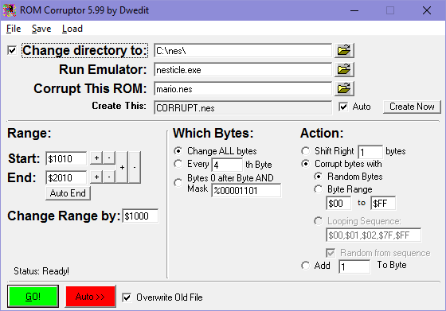

# Old Corruptors

> _Some of the oldest ROM corruption software date back to the year 2000, before the creation and the popularization of the Vinesauce ROM Corruptor. Some of these are meant mostly for editing NES ROMs without the use of a full Hex editor, the ability to break games being a secondary use._

* [**Index**](old-corruptors.md)
  * [ROM Corruptor](old-corruptors.md#rom-corruptor)
  * [Corrupster](old-corruptors.md#corrupster)
  * [Erosion](old-corruptors.md#erosion)
  * [NoChaos](old-corruptors.md#nochaos)
  * [Sapros](old-corruptors.md#sapros)
  * [Permanent Game Genie](old-corruptors.md#permanent-game-genie)

### ROM Corruptor

**Author:** Alan Weiss  
**Release date:** May 26, 2001  
**Also known as:** CORRUPT  
**Download:** [https://www.romhacking.net/utilities/5/](https://www.romhacking.net/utilities/5/)

> _Originally made to hack NES ROMs by modifying individual bytes or byte ranges, it's secondary use of breaking games is a popular alternative. ROM Corruptor was_ [_originally used by Vinesauce_](https://youtu.be/b3SubgihMfE?t=6s) _in their early days of streaming corruptions._

### Corrupster

**Author:** "Disch"  
**Release date:** 26 July, 2009  
**Download:** [https://www.romhacking.net/utilities/2/](https://www.romhacking.net/utilities/2/)

> _Corrupster was originally made as a utility for hacking Final Fantasy 1 NES Roms but can be used for corrupting any NES ROM, as well as any file as long as you switch the file type off of .nes. Because it does not ask for an emulator, it saw some limited use early on as a corruptor for files instead of ROMs._

### Erosion

**Author:** "Syizm"  
**Release date:** June 10, 2000  
**Download:** [https://www.zophar.net/utilities/corruptutil/erosion.html](https://www.zophar.net/utilities/corruptutil/erosion.html)

> _The Corruptor is based off of an unknown software called File Corrupt 4.0 according to it's_ [_Zophar page_](https://www.zophar.net/utilities/corruptutil/erosion.html)_. Erosion was a more advanced corruptor for it's time with features like using powers, values, random values, overwrite specific values and byte ranges among other options. It has option backup and option logging features so you can know what offsets were written and what value was placed within. The source code is included with the first version._

### NoChaos

**Author:** "jathys"  
**Release date:** July 24, 2002  
**Download:** [https://www.zophar.net/utilities/corruptutil/nochaos.html](https://www.zophar.net/utilities/corruptutil/nochaos.html)

> _NoChaos is more of a recursive Hex editor than it is meant to be a corruptor. However it's description on his website states that it is used for "Controlled corruption"._
>
> \_\_

### Sapros

**Author:** "Dan"  
__**Release date:** January 31, 2005  
**Download:** [https://www.romhacking.net/utilities/254/](https://www.romhacking.net/utilities/254/)

> _Sapros is a simple NES ROM corruptor that utilises the CDL files produced by FCEUXD, a NES debugger, to provide added precision to the corruption process._

## Permanent Game Genie

**Author:** Robert A. Durbin  
**Release date:** March 2, 2002  
**Download:** [https://www.romhacking.net/utilities/784/](https://www.romhacking.net/utilities/784/)

> _Not a corruptor in the traditional sense but this program takes Game Genie code and permanently inserts them into NES ROMs, normally with Game Genie codes they are executed within an emulator instead of being written directly to the ROM. Using this tool you can overlap some interesting codes and create unique corruptions._

## Contribution

If you know of any old corruption software please make a submission here: [github.com/x8BitRain/corruption-wiki-media](https://github.com/x8BitRain/corruption-wiki-media)

